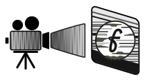

# fengo

<p align="center">
  
</p>

<p align="center">
  
  
  
  
</p>

`fengo` is a lightweight, customizable ASCII art font rendering engine written in Go. It is designed to be simple, secure, and easily extensible with your own JSON-based font formats. It's built with focus on customizability and simplicity.

## Features

- **Custom JSON Fonts**: Define your own fonts in a simple JSON format.
- **Color Support**: Built-in support for standard ANSI colors.
- **Case Insensitivity**: Automatically falls back to uppercase if lowercase characters are missing.
- **Zero Dependencies**: Uses only the Go standard library.

## Installation

```bash
go build -o fengo cmd/fengo/main.go
```

## Usage

```bash
./fengo [flags] <text>
```

### Flags

- `--font`: Name of a font in `assets/fonts/` (without .json) or a path to a custom JSON font file. Default: `mini`.
- `--color`: Color to apply to the output.

### Available Fonts

`mini` (default), `block`, `dots`, `slant`.

### Available Colors

`red`, `green`, `yellow`, `blue`, `purple`, `magenta`, `pink`, `cyan`, `white`.

### Examples

```bash
./fengo --font slant --color cyan "Fengo"
./fengo --font block --color green "Hello World"
./fengo --font dots --color pink "Dots"
```

## Creating Custom Fonts

Fonts are stored as JSON files. Each font requires a `name`, a `height`, and a `characters` map where each key is a single character and the value is a list of strings representing the rows of that character.

Example:
```json
{
  "name": "mini",
  "height": 5,
  "characters": {
    "A": ["  A  ", " A A ", "AAAAA", "A   A", "A   A"],
    " ": ["     ", "     ", "     ", "     ", "     "]
  }
}
```

## License

MIT
